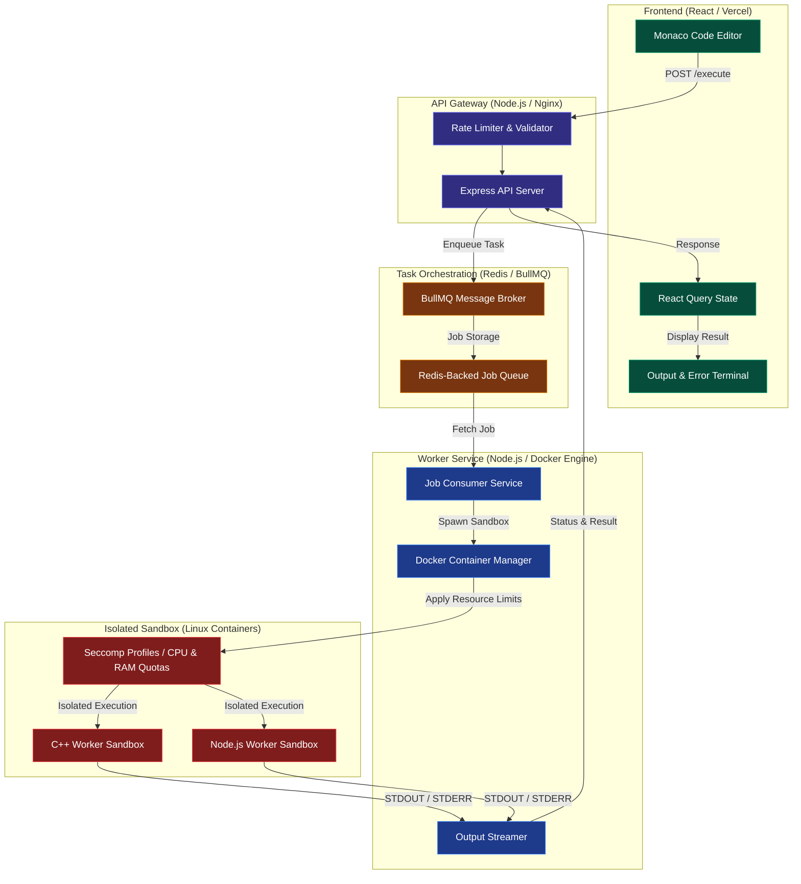

# Remote Code Execution (RCE) Web Application

A full-stack web application that allows users to write, submit, and execute code in multiple languages (C++, Java, Python, JavaScript) securely in isolated Docker containers. The app features real-time job status updates, syntax validation, and robust error handling.



## Features

- **Multi-language support:** C++, Java, Python, JavaScript
- **Monaco Editor** for code editing
- **Job queue** with Bull and Redis for scalable execution
- **Secure Docker sandboxing** (resource limits, network disabled, seccomp on Linux)
- **Syntax validation** before execution for all languages
- **Real-time job status polling**
- **Clear error feedback** for syntax, runtime, and system errors

## Project Structure

```
rce-app/
  src/           # React frontend
  server/        # Node.js/Express backend
  public/        # Static files for frontend
  package.json   # Frontend dependencies/scripts
  README.md
```

## Prerequisites

- **Node.js** (v16+ recommended)
- **npm** (v8+ recommended)
- **Docker** (required for code execution)
- **Redis** (can be run via Docker Compose)
- **MongoDB** (optional, for logging if enabled)

## Quick Start

### 1. Clone the repository

```sh
git clone https://github.com/kanishkIIITD/Remote-Code-Execution
cd rce-app
```

### 2. Install dependencies

```sh
npm install
cd server
npm install
cd ..
```

### 3. Environment Variables

Create a `.env` file in `server/` with the following (if using MongoDB):

MONGO_URI=mongodb://localhost:27017/rce
REDIS_URL=redis://localhost:6379
PORT=5000

> If you use Docker Compose, these are set up automatically.

### 4. Start Redis (and MongoDB, if needed)

You can use Docker Compose for all services:

```sh
cd server
docker-compose up
```

Or run Redis and MongoDB manually if you prefer.

### 5. Start the Application

From the root directory:

```sh
npm run dev
```

- This runs both the frontend (React) and backend (Express) concurrently.
- The frontend will be available at [http://localhost:3000](http://localhost:3000)
- The backend API runs at [http://localhost:5000](http://localhost:5000) (proxied for frontend requests).

## Usage

1. **Select a language** from the dropdown.
2. **Write or paste your code** in the Monaco editor.
3. **Click Submit** to run the code.
4. **View output or errors** in the output panel. The app will show real-time job status and display any syntax or runtime errors.

## API Endpoints

- `POST /api/v1/execute`  
  Submit code for execution.  
  **Body:** `{ code: string, language: string }`  
  **Returns:** `{ jobId: string, status: string }`

- `GET /api/v1/job-status/:jobId`  
  Poll for job status and result.  
  **Returns:**  
    - `{ status: 'completed', result: string }`
    - `{ status: 'failed', error: string }`
    - `{ status: 'waiting' | 'active' }`

## Security & Resource Controls

- **Docker containers** run with:
  - Memory and CPU limits
  - Network disabled
  - Read-only code mounts
  - Seccomp profile (on Linux)
- **Syntax validation** is performed before execution for all languages.
- **Timeouts** are enforced for code execution.

## Supported Languages

- **C++** (`cpp`)
- **Java** (`java`)
- **Python** (`python`)
- **JavaScript** (`javascript`)

## Troubleshooting

- **Docker must be running** for code execution to work.
- If you see errors about seccomp on Windows, the app will automatically fall back to Docker's default security.
- Make sure Redis is running and accessible at the configured URL.
- For syntax validation, ensure `g++`, `javac`, and `python`/`python3` are installed and available in your system PATH.

## Development

- **Frontend:** React, Tailwind CSS, Monaco Editor
- **Backend:** Node.js, Express, Bull, Dockerode, Redis, (optional: MongoDB)
- **Job queue:** Bull (with Redis)
- **Containerization:** Docker

## License

MIT

## Contributing

Pull requests and issues are welcome!
